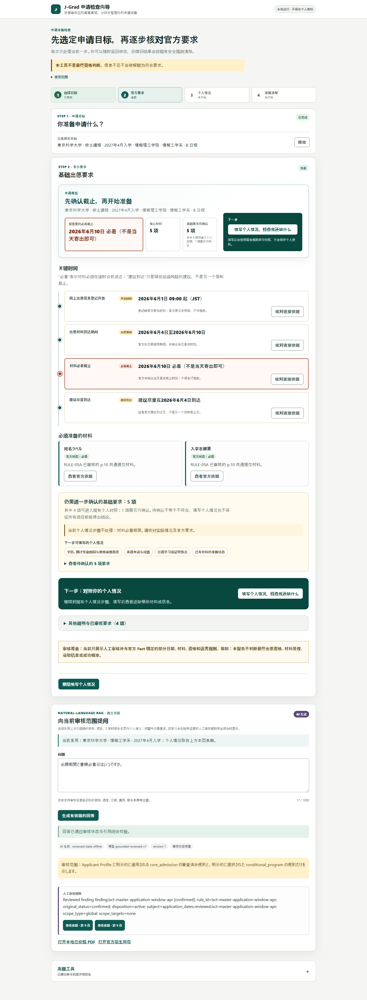

# J-Grad Admission RAG

An evidence-grounded, rule-augmented RAG system for Japanese graduate admissions, with hybrid
retrieval and page-linked official sources.

面向日本大学院募集要项的可信混合 RAG 系统，通过语义检索、BM25、申请者规则推理和官方页码引用，
生成有证据约束的申请回答。

> **Current status:** M1–M9 are complete and M10 productization is active. The local Demo now
> normalizes and splits Japanese, Chinese, or mixed questions, retrieves all bounded subquestions
> with the configured hybrid index, combines reviewed rule state into one bounded bundle, and
> retains natural wording only after typed claim and citation validation. Exact validated repeats
> use a bounded process-local cache while missing evidence remains explicit.

## What Applicants Can Verify Today

The local Chinese-language Demo guides an applicant through a reviewed four-step workflow for one
fixed official Science Tokyo master's guideline:

- choose the school, degree, April 2027 intake, college, and department;
- review key dates, education and individual-eligibility-review paths, language information, and
  common application materials;
- compare those reviewed requirements with an in-memory Applicant Profile;
- see a conservative gap summary and session-only preparation checklist;
- open the exact Japanese official text, physical PDF page, local PDF viewer, and official webpage.
- ask a Japanese or Chinese question within the reviewed eligibility, language, date, fee, or
  contact scope and inspect the server-validated answer citations.



The current packaged Demo is intentionally narrow: it covers the hash-verified `2027 April / 2026
September Master's Program Admission Guidelines` for Science Tokyo and the reviewed target/rule
scope shipped in `src/jgrad_admission_rag/demo_config`. It does not support other schools, accounts,
cloud persistence, public deployment, or final eligibility, receipt, completeness, or admission
decisions.

## Trust Architecture

```text
exact official PDF
  -> traceable ScopedFacts + pages
  -> pinned semantic retrieval + BM25 + RRF
  -> EvidencePack candidates
  -> Applicant Profile + human-reviewed rules
  -> typed server-owned propositions + replaceable Generation provider
  -> validated natural answer + page-linked citations + exact TTL/LRU cache
```

`ScopedFact` remains the authority for official text and pages. Retrieval proposes evidence; it does
not decide whether a rule applies. Reviewed rules compare explicit Applicant Profile fields. The
generator may organize only those inputs, while the server owns evidence IDs and validates every
citation. No vector database is used: the current index is a rebuildable local NumPy artifact.

The repository already includes a pinned BGE-M3 identity, a Sentence Transformers adapter, BM25,
RRF, a 42-query mixed-language retrieval benchmark, and offline semantic and grounded-RAG release
gates. The packaged Demo still defaults to `deterministic-fake` embeddings for fast, repeatable
offline assembly; that provider is non-semantic and must not be used as evidence of multilingual
retrieval quality. Formal semantic acceptance uses the pinned BGE-M3 cache-only path documented
below.

## Quick Start: Reviewed Local Demo

Requirements: Windows PowerShell, Python 3.11+, and the exact official PDF linked below.

```powershell
git clone https://github.com/yasu-isct/J-Grad-Admission-RAG.git
cd J-Grad-Admission-RAG
python -m venv .venv
.\.venv\Scripts\Activate.ps1
python -m pip install -e ".[service]"
jgrad-demo --pdf D:\path\to\isct_2027_4_2026_9_master.pdf
```

Open `http://127.0.0.1:8000/app`. The PDF path must be absolute and its SHA-256 must match the
packaged reviewed identity. The repository does not redistribute the PDF or download it for you.
Run `jgrad-demo --help` to inspect the supported local options.

## 运行真实本地 Demo

从东京科学大学[大学院募集要项页面](https://admissions.isct.ac.jp/ja/013/graduate/guideline)
下载固定版 `2027 April / 2026 September Master's Program Admission Guidelines` PDF。仓库不重新
分发该文件，也不会扫描下载目录或联网获取 PDF。然后在 Windows PowerShell 中运行：

```powershell
python -m pip install -e ".[service]"
jgrad-demo --pdf D:\path\to\isct_2027_4_2026_9_master.pdf
```

`--pdf` 必须是显式绝对路径。启动器会在解析前使用打包的唯一审核身份核对 SHA-256，并在成功时
打印已核对值；也可先用 `Get-FileHash <path> -Algorithm SHA256` 查看本地值。匹配后，首次启动在
`./outputs/demo/isct_2027_4_2026_9_master` 中生成 KB、离线兼容索引、corpus manifest 和 active
policy，随后以正式 `jgrad-serve` 所用的 FastAPI 装配在 `http://127.0.0.1:8000/app` 提供页面。
首次 PDF 解析和索引可能需要一些时间；看到 Uvicorn 的 application startup complete 后即可打开
页面。按 `Ctrl+C` 停止。

日期区域会显示四项审核后的中文结论，并可在证据抽屉核对被突出显示的日文直接依据。抽屉中的
“在 PDF 中查看第 N 页”通过本机只读路由打开已校验的同一份 PDF；是否自动跳到 `#page=N`
取决于浏览器自带 PDF viewer，页面同时保留页码提示和官方招生网页入口。

审核身份、最终 reviewed plan、page-scope 和 query-intent 配置随包位于
`src/jgrad_admission_rag/demo_config`；启动路径不会读取 `tests/fixtures` 或 pytest 输出。

重复启动会重新审计 PDF 身份、审核配置、KB/index、manifest、policy、reviewed plan 和 page-scope，
仅复用完全匹配的 workspace。需要明确重建时运行：

```powershell
jgrad-demo `
  --pdf D:\path\to\isct_2027_4_2026_9_master.pdf `
  --workspace D:\jgrad-demo-workspace `
  --port 8010 `
  --rebuild
```

`--workspace` 必须是绝对可写目录。`--rebuild` 只替换该 workspace 内由 `jgrad-demo` 拥有的
`runtime-v1`；也可以在服务停止后删除整个自选 workspace。默认索引使用
`deterministic-fake`，只用于完全离线、可复现的本地装配，不代表真实语义检索质量，不需要付费 API
或外网请求。服务固定绑定 `127.0.0.1`，不要将这个无认证 Demo 暴露到局域网或公网。

如已单独准备好仓库固定版本的 BGE-M3 cache，可选择正式语义路径：

```powershell
python -m pip install -e ".[service,embedding]"
jgrad-demo `
  --pdf D:\path\to\isct_2027_4_2026_9_master.pdf `
  --workspace D:\jgrad-demo-bge-m3 `
  --embedding-provider bge-m3 `
  --embedding-cache D:\path\to\reviewed-cache
```

Demo 将 BGE-M3 固定为 `BAAI/bge-m3` revision
`5617a9f61b028005a4858fdac845db406aefb181`、1024 维，并始终以 cache-only 模式加载；启动器
不会静默下载模型。cache 缺失或不完整时会在服务启动前失败并说明安装/准备方式。启动输出会显示
经索引审计后的 provider、model、revision、dimension 和 `semantic=true/false`。同一 workspace
若由另一 provider 构建，需使用单独 workspace，或在核对路径后显式 `--rebuild`。

常见失败及处理：

- PDF 缺失或哈希不符：从上面的官方页面重新下载指定版本，不要改名推断或选择“最新文件”。
- 端口占用：增加 `--port 8010` 等未占用 loopback 端口。
- 缺少 FastAPI/Uvicorn：重新运行 `python -m pip install -e ".[service]"`。
- workspace 过期、损坏或工件不兼容：核对目录后显式增加 `--rebuild`。
- 目录无写权限：用 `--workspace` 指向一个明确、绝对且可写的窄目录。

该 Demo 无账户、无上传、无 Applicant Profile 持久化、无遥测，也不生成最终资格、材料完整性、
受理或录取结论。申请人输入仅留在当前浏览器页面和请求生命周期内。

自然语言区域先以严格结构分析中文、日文或混合问题，再在本地为全部子问题执行受限检索与规则
判断，最后最多调用一次生成模型形成综合回答。服务器只保留通过类型化命题、数字、适用范围和
引用闭合校验的自然措辞；它仍不是任意 PDF 或互联网聊天。完全相同且版本仍有效的成功结果可
命中进程内有界 TTL/LRU cache，此时不再调用问题理解或生成模型；cache 不写磁盘，服务重启即
失效。默认生成器 `reviewed-state-offline` 完全离线，并明确显示“离线规则结果”。可选 OpenAI
Responses provider 仍受同一结构化输出和引用校验边界约束：

```powershell
$env:OPENAI_API_KEY = "<set-locally; never commit>"
jgrad-demo `
  --pdf D:\path\to\isct_2027_4_2026_9_master.pdf `
  --embedding-provider bge-m3 `
  --embedding-cache D:\J-Grad-Admission-RAG\outputs\model-cache `
  --generation-provider openai-responses `
  --generation-model gpt-5.4-mini-2026-03-17
```

如使用 DeepSeek，必须显式选择独立 provider；它不会读取 `OPENAI_API_KEY`，也不能配置任意
Base URL：

```powershell
$env:DEEPSEEK_API_KEY = "<set-locally; never commit>"
jgrad-demo `
  --pdf D:\J-Grad-Admission-RAG\outputs\real_pdf\isct_2027_4_2026_9_master.pdf `
  --workspace D:\J-Grad-Admission-RAG\outputs\m10-deepseek-live `
  --embedding-provider bge-m3 `
  --embedding-cache D:\J-Grad-Admission-RAG\outputs\model-cache `
  --generation-provider deepseek-responses `
  --generation-model deepseek-flash
```

DeepSeek provider 固定使用 `https://api.deepseek.com` 的非流式 Responses API，只允许
`deepseek-flash` 或 `deepseek-v4-pro`，并通过 `text.format` JSON Schema 与本地 Pydantic、引用
闭合校验双重验证输出。页面会显示实际模型；缺少密钥时显示“DeepSeek 在线生成服务未配置”，
不会改用离线文本后继续标成 AI 生成。
DeepSeek 的默认单次请求超时为 90 秒（OpenAI 保持 30 秒）；可以通过
`--generation-timeout-seconds` 显式收紧，但现有 120 秒硬上限保持不变。
有据回答固定关闭 DeepSeek 思考输出，避免隐藏推理占用结构化输出预算；多语言问题分析保留模型
默认思考能力。服务器仍执行完整 Pydantic、语义约束、审核状态和引用闭合校验。
新问题最多使用一次问题理解和一次综合生成调用；页面显示实时生成或已验证缓存、生成/校验耗时
和知识库短版本。cache key 覆盖问题、目标、相关申请信息、KB/PDF、索引、规则、prompt、schema、
provider、model、revision、page-scope 和投影器版本，任何一项变化都会 miss。缓存值只含已校验
claim、安全引用键和子问题 disposition，不含问题正文、Applicant Profile、检索词、证据正文或原始
模型响应；命中时由当前审核状态重建证据抽屉。失败、拒绝或未通过校验的结果不会缓存。

未设置密钥时，普通结构化流程和服务 readiness 不受影响，页面显示“在线生成服务未配置”，不会
伪装成联网 AI 或静默降级。代码不提供任意 Base URL，使用 SDK 默认官方地址；请求固定
`store=False` 并限制 timeout、输出 token 与 SDK retry。仓库和默认 CI 不调用付费 API，真实请求
必须另外获得精确调用次数授权。参见
[Natural-language RAG productization v1](docs/natural-language-productization-v1.md) 与
[DeepSeek Responses provider v1](docs/deepseek-responses-provider-v1.md)、
[M10 language/score coverage audit](docs/evaluation/m10-language-coverage-audit.md)。

## M9 Release Evidence

The checked-in M9-05 gate recomputes deterministic metrics from 20 human-reviewed cases and a
cache-only BGE-M3 retrieval report. The accepted formal run produced 6 grounded answers, 4
needs-information results, and 10 safe refusals. Citation correctness, citation completeness,
groundedness, refusal correctness, and missing-information correctness are all `1.0`; unsupported
claim rate is `0.0`. Recall@10 is `0.6364`, subset MRR is `0.2455`, and Chinese-to-Japanese hit rate
is `0.50`, all computed from the formal service's recorded rankings. The broader 42-query retrieval
report records Recall@10 `0.8495` and MRR `0.8312`.

```powershell
jgrad-check-grounded-rag-gate `
  --suite tests\fixtures\grounded_rag_evaluation_suite_v1.json `
  --observations tests\fixtures\grounded_rag_observations_v1.json `
  --retrieval-benchmark tests\fixtures\grounded_rag_retrieval_queries_v1.json `
  --retrieval-report tests\fixtures\grounded_rag_retrieval_report_v1.json `
  --report tests\fixtures\grounded_rag_evaluation_report_v1.json `
  --policy config\grounded_rag_release_gate_v1.json `
  --repository-root .
```

See [Grounded RAG Release Evaluation](docs/evaluation/grounded-rag-release-v1.md) for metric scope,
reproduction boundaries, real-browser acceptance, and the separately authorized paid-provider
workflow.

## Run The Local API

The optional APP-01 service exposes the accepted build and corpus-query workflows without adding a
second implementation:

```powershell
python -m pip install -e ".[service]"
jgrad-serve `
  --corpus-root D:\corpus `
  --manifest D:\corpus\corpus.json `
  --policy D:\corpus\policy.json `
  --report-plan D:\jgrad-plans\example-master-2027.json `
  --page-scope-manifest D:\jgrad-scopes\example-master-2027.json `
  --query-intent-catalog D:\jgrad-config\query_intent_catalog_v1.json `
  --provider deterministic-fake `
  --dimension 8
```

OpenAPI is served at `http://127.0.0.1:8000/openapi.json`, with local interactive docs at
`http://127.0.0.1:8000/docs`. The evidence-review UI is available at
`http://127.0.0.1:8000/app`. The two local tabs provide evidence search and a partial applicant
report over reviewed rules. The API provides `/v1/health/live`, `/v1/health/ready`, synchronous
multipart KB build, strict reviewed-corpus query, and cited applicant-report routes. Report plans
are optional, server-owned, explicitly allowlisted with repeatable absolute `--report-plan` paths.
Reporting additionally requires one identity-matched, manually reviewed `--page-scope-manifest` per
enabled document; omitting or mismatching either side fails readiness closed. Browser question
parsing uses one explicit absolute `--query-intent-catalog` path. These artifacts are loaded only
during service lifespan; no directory discovery occurs. See
[Service API v1](docs/service-api-v1.md).

The packaged [Local Evidence Review UI](docs/local-evidence-ui.md) lists only audited, ready
documents with a unique reviewed plan. One tab sends one-document searches to the existing query
API; the other builds a strict applicant profile, obtains intent from the server, and displays the
existing partial cited report. Neither view makes an overall eligibility or admission conclusion.
The page and its assets are local and dependency-free; no npm build, CDN, browser storage,
analytics, or query/profile persistence is used.

The default bind is loopback and real model loading is cache-only unless download is explicitly
authorized. The service has no authentication, TLS, rate limiting, or public-deployment hardening;
do not expose it directly to a network. Use an authenticated reverse proxy and a separate
operational review before any non-loopback deployment.

The asynchronous build foundation stores strict job records in SQLite and identity-bound inputs in
server-owned UUID directories. It provides atomic state transitions, restart recovery, explicit
retry, validated result publication, and exact terminal deletion for the later worker/API slice; it
does not start background work by itself. See
[Durable Build Job Storage v1](docs/service-job-storage-v1.md).

The bounded local build worker explicitly opens that repository, drains queued jobs off the async
event loop, and records complete quality, failure, or cancellation outcomes. Versioned build-job
routes expose submit/status/result/cancel/retry/exact-delete operations when an explicit
`--job-root` is configured. See
[Durable Build Worker v1](docs/service-build-worker-v1.md).

Applicant reporting begins from a server-owned `ReviewedReportPlan`, which binds one exact reviewed
document to its existing applicability, precedence, and interaction policies while declaring only
partial coverage. It is configuration rather than a request or conclusion; exact official Fact
text is materialized only by the later report workflow. See
[Reviewed Report Plan v1](docs/reasoning/reviewed-report-plan-v1.md).

`ReviewedReportEvidenceBundle` then materializes only the exact Facts named by that plan after corpus
audit, one-document selection revalidation, and page-scope enforcement. Ordinary rule bindings must
come from `core_admission`; a conditional-program binding must match its declared route, and the
final report removes it unless the Applicant Profile selects that exact route. All KB Facts and page
provenance remain unchanged for audit. See
[Reviewed Report Evidence v1](docs/reasoning/reviewed-report-evidence-v1.md).

`ApplicantReport` combines that reviewed plan and exact evidence with one profile and covered intent,
then delegates to the existing applicability, precedence, interaction, trace, and cited-answer APIs.
The strict report and fixed Japanese Markdown remain visibly partial, include a literal official-text
appendix, and never claim overall eligibility or admission. See
[Applicant Report v1](docs/reasoning/applicant-report-v1.md).

The local service also exposes a fail-closed natural-language grounded answer endpoint and an
independent page area that reuse the current reviewed target and in-memory applicant profile. The
packaged provider is deterministic and offline; every displayed factual claim is closed against
server-owned reviewed evidence before it reaches the browser. See
[Natural-language grounded RAG API and page v1](docs/natural-language-grounded-rag-v1.md).

The current RULE-05A plan also projects the five p.10 common application materials from one
authoritative Fact. Items 3–5 are handled by the separate eligibility-review material path for
eligibility routes (9)–(11), and remain `needs_information` when the profile cannot identify the
route. This is requirement applicability only, not proof of submission, receipt, or acceptance.

`POST /v1/applicant-reports` is the thin APP-03D transport over those accepted boundaries. It
requires one exact corpus document and unique allowlisted plan, then returns the complete strict
report and byte-for-byte deterministic Markdown without retrieval, model calls, persistence, or an
overall eligibility/admission claim.

After initializing a canonical manifest through the library builder, activate one prepared KB/index
registration without touching other artifacts:

```powershell
jgrad-update-corpus D:\corpus\corpus.json `
  --corpus-root D:\corpus `
  --action add `
  --kb isct/2028/document_kb.json `
  --index indexes/isct-2028
```

Registration paths are POSIX relative paths, so use `/` inside `--kb` and `--index` even on Windows.
`replace` additionally requires `--replace-document-id`. The command validates and audits before
atomically replacing only the manifest file; it never builds or deletes an index. See
[ADR 0004](docs/decisions/0004-atomic-corpus-manifest-activation.md).

Before cross-document retrieval, a separate reviewed `CorpusVersionPolicy` must classify every
manifest document as active or historical. Selection requires a positive identity constraint and
defaults to one active, ready document; historical, all-version, and multi-document use are explicit
opt-ins. The selector reads no index files and performs no ranking. See
[Corpus Version Policy v1](docs/corpus-version-policy-v1.md).

## Build A Local Index

The deterministic fake provider verifies the indexing pipeline without downloading a model. Its
vectors are reproducible but non-semantic and must not be used to judge retrieval quality:

```powershell
python -m pip install -e .
jgrad-build-index outputs\kb\sample\document_kb.json `
  --output outputs\index\sample-fake `
  --provider deterministic-fake `
  --dimension 8
```

For real multilingual embeddings, install the optional runtime and name an exact model revision.
The default is offline/cache-only; `--allow-model-download` is an explicit network and disk-use
permission and should be used only after reviewing the model and revision:

```powershell
python -m pip install -e .[embedding]
jgrad-build-index outputs\kb\sample\document_kb.json `
  --output outputs\index\sample-bge-m3 `
  --provider sentence-transformers `
  --model BAAI/bge-m3 `
  --revision <40-character-commit-sha> `
  --dimension 1024 `
  --batch-size 8 `
  --cache-folder .cache\models
```

The output directory must not already exist; the command never overwrites or deletes an index. A
successful build contains `manifest.json`, `payloads.jsonl`, and `embeddings.npy`, then prints one
JSON summary with counts, provider identity, and artifact hashes. The `jgrad-search` command below
queries the index after the IDX-08 freshness checks and safe replacement policy described below.

## Search A Local Index

Search uses exhaustive NumPy cosine similarity over the validated, normalized index. Higher scores
rank first; exact ties use the lower payload `row_index`. `--top-k` defaults to `5`, and requesting
more rows than exist simply returns every row. The command is read-only and emits one JSON object
whose results retain the payload text, Fact/Unit IDs, scope, section path, and official PDF pages.

Use the exact provider identity that built the index. This fake example is deterministic and useful
only for checking ranking and provenance plumbing, not semantic relevance:

```powershell
jgrad-search outputs\index\sample-fake `
  --current-kb outputs\kb\sample\document_kb.json `
  --query "出願資格" `
  --top-k 5 `
  --provider deterministic-fake `
  --dimension 8
```

A real index built with Sentence Transformers must be searched with the same model, pinned revision,
and dimension. Loading is cache-only unless download is explicitly authorized:

```powershell
jgrad-search outputs\index\sample-bge-m3 `
  --current-kb outputs\kb\sample\document_kb.json `
  --query "情報工学系の出願資格" `
  --provider sentence-transformers `
  --model BAAI/bge-m3 `
  --revision <same-40-character-commit-sha> `
  --dimension 1024 `
  --cache-folder .cache\models
```

`--current-kb` is required. Search first validates index integrity, then compares the exact current KB
bytes, document/PDF provenance, and declared provider/model/revision/dimension with the manifest. A
fresh result includes the current KB SHA-256 and checked fields. `stale_index` means the index is
internally valid but no longer matches one or more current inputs; `current_kb_error` means the
current KB itself is missing, symlinked, malformed, unsupported, or failed its quality gate.

Stale indexes are never replaced automatically. Build a replacement into a new absent directory,
validate it, switch the caller/configuration to that path, and retire the old directory separately.
Automatic overwrite, delete, or directory swapping is deliberately absent because portable atomic
replacement and crash recovery require a separate design. See
[ADR 0002](docs/decisions/0002-index-freshness-and-replacement.md).

Returned rows are retrieval candidates, not applicant-specific decisions or final answers. Later
milestones add profile-aware reasoning and reporting.

The benchmark evaluator produces a strict diagnostic report over the exact declared queries:

```powershell
jgrad-evaluate-retrieval outputs\index\sample-bge-m3 `
  --current-kb outputs\kb\sample\document_kb.json `
  --benchmark tests\fixtures\retrieval_queries_v1.json `
  --provider sentence-transformers `
  --model BAAI/bge-m3 `
  --revision <same-40-character-commit-sha> `
  --dimension 1024 `
  --cache-folder .cache\models
```

It runs cache-only hybrid retrieval with empty filters and preferences, then reports primary-only
Recall@1/3/5/10, MRR, breakdowns, and missing-gold diagnostics. Fake embeddings validate plumbing
but are never quality-eligible. See
[Retrieval Evaluation v1](docs/evaluation/retrieval-evaluation-v1.md).

## Semantic Regression Gate

The checked-in semantic gate verifies the reviewed RET-08 baseline without loading a model, KB, or
vector index. It binds the compact report, frozen benchmark, BGE-M3 identity, retrieval metrics,
and signed retrieval-affecting source set. The report includes 34 Japanese and four Chinese queries;
the accepted quality floors remain explicitly scoped to Japanese while the Chinese cross-language
slice is recorded separately. It is the CI guard for retrieval changes, not a replacement for a new
semantic evaluation when the benchmark or intended behavior changes:

```powershell
jgrad-check-retrieval-gate `
  --report tests\fixtures\semantic_retrieval_baseline_v1.json `
  --policy config\semantic_retrieval_gate_v1.json `
  --manifest config\semantic_retrieval_gate_manifest_v1.json `
  --repository-root .
```

Exit code `0` means the frozen baseline satisfies policy, `1` means a measured policy failure, and
`2` means an unsafe or malformed input/contract. The command is cache-free and CI sets Hugging Face
and Transformers to offline mode. See
[ADR 0003](docs/decisions/0003-semantic-retrieval-regression-gate.md).

Hybrid retrieval is opt-in while evaluation thresholds are still being established. It combines
vector and lexical ranks with fixed Reciprocal Rank Fusion and leaves the default vector response
unchanged:

```powershell
jgrad-search outputs\index\sample-bge-m3 `
  --current-kb outputs\kb\sample\document_kb.json `
  --query "情報工学系のTOEFL提出条件" `
  --retrieval-mode hybrid `
  --candidate-k 50 `
  --provider sentence-transformers `
  --model BAAI/bge-m3 `
  --revision <same-40-character-commit-sha> `
  --dimension 1024 `
  --cache-folder .cache\models
```

Hybrid output reports `rrf-v1`, `RRF_K=60`, candidate depths, channel counts, and each hit's vector
and lexical provenance. See [the hybrid retrieval contract](docs/evaluation/hybrid-retrieval.md).

Explicit metadata constraints and scope preferences are available only in hybrid mode. For example,
this request keeps exact `english` Facts and then prefers exact Information Engineering scope:

```powershell
jgrad-search outputs\index\sample-bge-m3 `
  --current-kb outputs\kb\sample\document_kb.json `
  --query "英語スコアの提出条件" `
  --retrieval-mode hybrid `
  --filter-fact-type english `
  --prefer-scope-target 情報工学系 `
  --prefer-parent-college 情報理工学院 `
  --provider sentence-transformers `
  --model BAAI/bge-m3 `
  --revision <same-40-character-commit-sha> `
  --dimension 1024 `
  --cache-folder .cache\models
```

Matching is exact and caller-supplied; the command does not infer department, college, degree, year,
or intake from the question. See [the metadata retrieval contract](docs/evaluation/metadata-retrieval.md).

Authoritative one-hop references can also be expanded in hybrid mode. This preserves the ranked
`results` array and adds a separate `reference_expansion` object containing resolved target evidence
plus visible ambiguous and unresolved diagnostics:

```powershell
jgrad-search outputs\index\sample-bge-m3 `
  --current-kb outputs\kb\sample\document_kb.json `
  --query "主な出願資格の下記（3）の条件" `
  --retrieval-mode hybrid `
  --expand-references `
  --provider sentence-transformers `
  --model BAAI/bge-m3 `
  --revision <same-40-character-commit-sha> `
  --dimension 1024 `
  --cache-folder .cache\models
```

Only builder-resolved targets become evidence. Ambiguous and unresolved claims are reported without
guessing, and expansion never changes primary ranks or recursively follows the attached target. See
[the reference expansion contract](docs/evaluation/reference-expansion.md).

For a stable downstream handoff, hybrid search can emit a canonical `EvidencePack` v1 instead of the
operator-oriented search summary. Reference expansion is included automatically:

```powershell
jgrad-search outputs\index\sample-bge-m3 `
  --current-kb outputs\kb\sample\document_kb.json `
  --query "情報工学系の出願資格" `
  --retrieval-mode hybrid `
  --output-format evidence-pack `
  --provider sentence-transformers `
  --model BAAI/bge-m3 `
  --revision <same-40-character-commit-sha> `
  --dimension 1024 `
  --cache-folder .cache\models
```

The pack preserves full official evidence and retrieval diagnostics, but makes no applicant-specific
decision and generates no answer. See [the EvidencePack v1 contract](docs/evaluation/evidence-pack-v1.md).

## Sentence Transformers Adapter

Install the optional model runtime separately with `python -m pip install -e .[embedding]`. The
adapter requires an explicit model name, an exact 40-character revision commit, and expected output
dimension. It is CPU-only, uses `trust_remote_code=False`, and defaults to cache-only loading; model
downloads occur only when a caller explicitly sets `allow_download=True`.

`BAAI/bge-m3` is the provisional M2 baseline because its official model card describes multilingual
1,024-dimensional embeddings and an 8,192-token input length. It is comparatively resource-heavy
and has not yet been proven best for Japanese admission retrieval; M3 evaluation will revisit the
choice. BGE-M3 receives the canonical text unchanged, with no query/document prefix or prompt.

Sentence Transformers normally truncates text beyond the model limit. This adapter tokenizes every
input with truncation disabled before encoding and raises `EmbeddingInputError` if any row is too
long. It never silently truncates, summarizes, or splits official content. See the
[BGE-M3 model card](https://huggingface.co/BAAI/bge-m3) and
[Sentence Transformers embedding documentation](https://www.sbert.net/examples/sentence_transformer/applications/computing-embeddings/README.html).
Constructor and encode options are documented in the
[SentenceTransformer API reference](https://www.sbert.net/docs/package_reference/sentence_transformer/model.html).

## Repository Layout

```text
src/jgrad_admission_rag/
  builder/      PDF extraction, chunking, document index, reference links, KB builder
  schemas/      Durable JSON contracts such as DocumentKnowledgeBase
  retrieval/    Embedding providers, local vector indexes, and future retrieval services
  reasoning/    Applicant/query contracts, reviewed applicability rules, later reasoning
  generation/   Provider-neutral structured drafts and optional generation adapters
  cli/          Command-line entry points
docs/           Architecture and migration notes
tests/          Focused unit tests
```

## Relationship To Other Repositories

- `flie-extract`: profile-guided long-document extractor for one applicant and one PDF.
- `J-Grad-Admission-RAG`: reusable admission knowledge-base builder and retrieval system.
- `Lab-Radar`: future research lab matching can consume this project's admissions knowledge layer.

## Roadmap

Development is organized as small, verifiable GitHub issues grouped by milestones. The current
priority is to make `document_kb.json` traceable and diagnostically reliable before adding vector
indexing.

See [docs/roadmap.md](docs/roadmap.md) for milestones, task IDs, acceptance gates, and the project
workflow.
