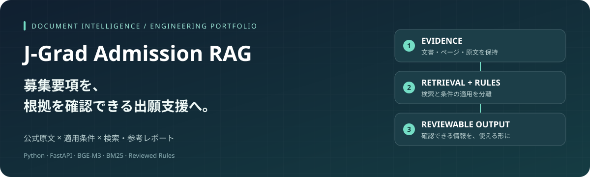
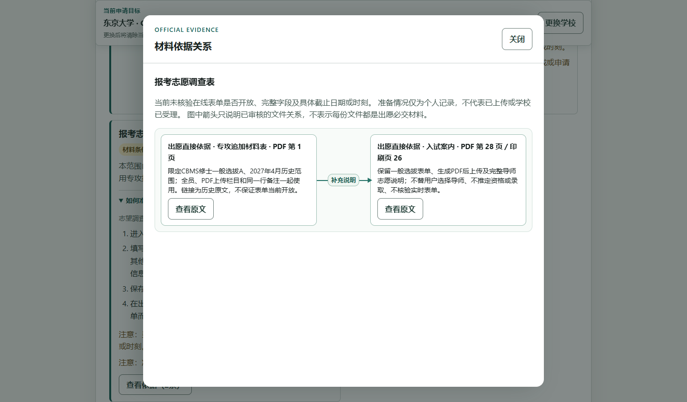
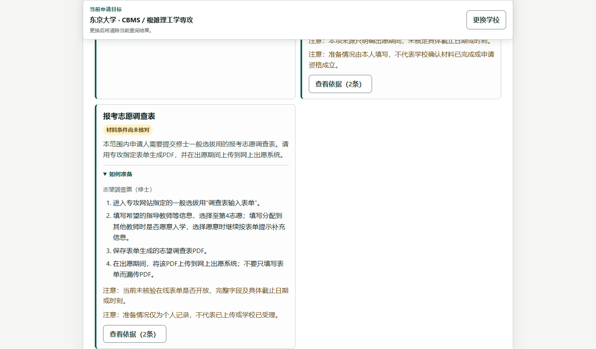
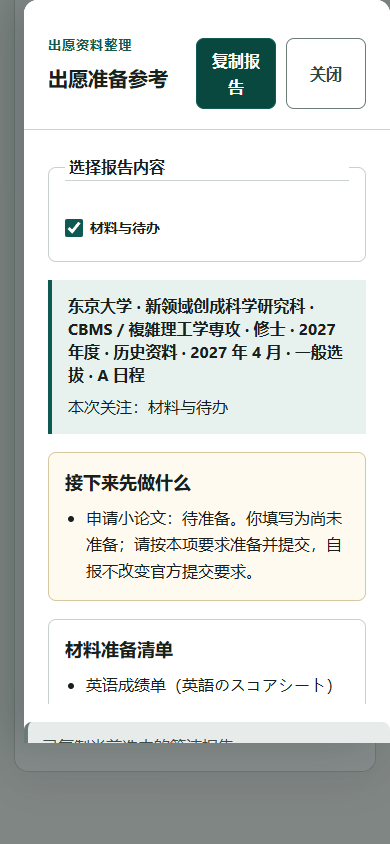
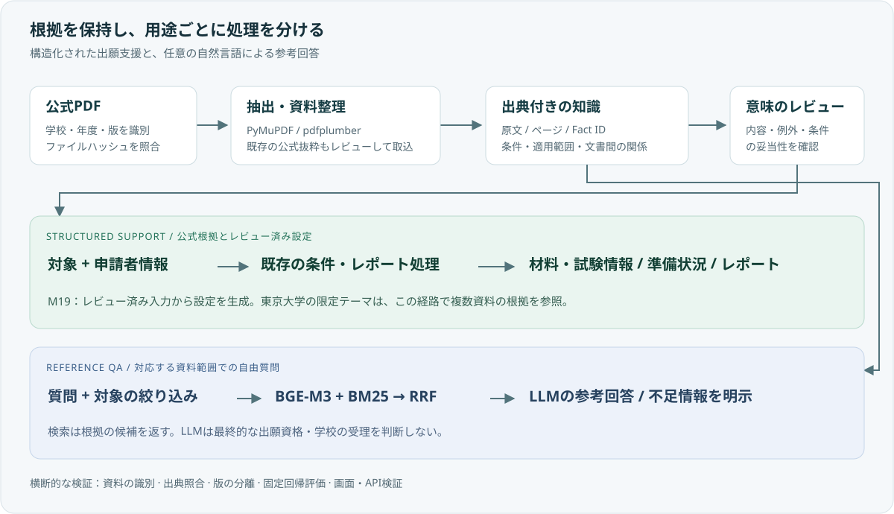

<p align="center">
  
</p>

<p align="center">
  <a href="https://github.com/yasu-isct/J-Grad-Admission-RAG/actions/workflows/quality.yml"></a>
  
  
  
</p>

<p align="center">
  <a href="#画面で見る">画面で見る</a> ·
  <a href="#設計のポイント">アーキテクチャ</a> ·
  <a href="docs/portfolio/engineering-ja.md">技術解説</a> ·
  <a href="docs/portfolio/local-demo-ja.md">ローカル実行</a>
</p>

# J-Grad Admission RAG

**日本の大学院募集要項を、出願条件・提出書類・試験情報として整理し、公式原文まで確認できるシステムです。**

留学塾の教務担当者が、研究科共通の募集要項と専攻別資料を往復しながら同じ情報を何度も調べる作業を支援します。対象校の選択、必要情報の確認、申請者の準備状況との照合、参考レポートの作成を一つの画面で行います。

RAGによる自由質問と、レビュー済みルールによる構造化表示を分離しています。検索結果やLLMの文章だけで出願資格を確定せず、資料の適用範囲・出典・未確認事項を保持する設計です。

> **公開デモ：M19の設定生成・5テーマ対応まで受入・マージ済み（2026年10月8日更新）。**
> 留学塾の教務支援システムの技術と代表機能を紹介する公開デモです。東京科学大学の固定版資料と東京大学・複雑理工学専攻の限定資料を収録。UIは中国語、公式原文は日本語です。

## 何を支援するか

| 教務担当者の作業 | システムでできること |
| --- | --- |
| 日付・提出書類・試験科目を探す | 選択した対象のレビュー済み情報を項目別に表示 |
| 学生ごとに準備状況を確認する | 公式の提出条件と本人の自己申告を分け、未準備・未確認を整理 |
| 複数資料を見比べる | 同じ論点に関係する公式資料をまとめ、関係と原文・ページを表示 |
| 確認内容を学生や同僚に渡す | 必要なテーマを選び、簡潔な参考レポートをプレビュー・コピー |
| 自由な質問をする | 対応する資料範囲で検索し、任意のLLMが参考回答を生成 |

塾内での利用を前提に、教務現場へのデモとフィードバックを反映して開発しています。このリポジトリは公開展示用の版です。後続の業務版は塾側の技術チームとの共同開発を予定し、非公開で継続する方針です。公開デモの収録範囲と内部運用版の開発計画は分けて記載しています。

## 画面で見る

**01 — 複数の公式資料を、一つの論点から確認する**



東京大学の志望調査票の例。提出の根拠と作成方法を別々の資料に結び付け、「原文を見る」から該当箇所を確認できます。

<table>
<tr>
<td width="65%" valign="top">
<strong>02 — 準備手順を具体的にする</strong><br>
<br>
名称の翻訳だけでなく、何を作り、どう提出するかを表示します。
</td>
<td width="35%" valign="top">
<strong>03 — 必要な情報を持ち帰る</strong><br>
<br>
本人の準備状況を含めた参考レポートをコピーできます。
</td>
</tr>
</table>

画像は既存の実装・受入証拠をそのまま使用しています。01は開発時の実HTTP検証、02・03は同じ実レスポンスを照合した設計側のブラウザ再生です。日本語UIのモックや本番利用実績を示す画像ではありません。[画面と証拠の一覧](docs/portfolio/screenshots-ja.md)

## 設計のポイント



### 1. 検索と条件判定を分ける

BGE-M3の意味検索とBM25のキーワード検索をRRFで統合します。検索は関連する根拠の候補を返し、条件の適用は明示的な申請者情報とレビュー済みルールで判定します。構造化された書類表示・レポートは、LLMの回答に依存しません。

### 2. 出典と適用範囲をデータとして保持する

学校・研究科・専攻・年度・入学時期・選抜ルート・資料版を識別します。公式原文、PDFページ、Fact ID、ファイルハッシュを結び付け、異なる対象や版の根拠が混ざらないよう検証します。ハッシュ照合は改変検知であり、内容の正しさは別途レビューします。

### 3. 複数資料の関係を再利用する

東京大学の限定機能は、共通要項・専攻案内・追加提出物一覧の**レビュー済みの関係**を利用します。質問のたびにモデルが自由に関係を発見する仕組みではありません。自動生成は設定の転記を減らし、新しい規則の意味を承認する責任は残します。

### 4. 再現性と資産の再利用を重視する

ベクトル索引はNumPyのローカル成果物として管理し、モデル版・次元・KB・payloadを照合します。通常起動では既存資産を読み取り専用で再利用。固定回帰基準の334ベクトルと製品用391ベクトルを分離し、無用な再構築や上書きを避けます。

## 現在の対応範囲

| 対象 | 実装済み | 範囲・制約 |
| --- | --- | --- |
| 東京科学大学・修士 | 出願日程、共通の提出書類、条件照合、参考質問、レポート。選択可能な18系・2入学時期の同じ要項に記載された試験情報 | 固定版「2027年4月／2026年9月入学」。各機能のレビュー済み範囲に限定。別冊の地球生命コース等は対象外 |
| 東京大学・新領域創成科学研究科・複雑理工学専攻（CBMS） | 英語成績表、チェックリスト自体、学業と職務の両立計画書、小論文、志望調査票の5テーマ | 2027年度修士・一般選抜A・2027年4月入学の固定資料。新配置を明示選択。全専攻・全提出書類・自由な東大RAG検索には未対応 |

過去の募集要項を使った検証です。現在の出願受付、最終的な出願資格、学校の受理・合否、提出書類の網羅性は保証しません。公開ホスティングは保留中です。

## 検証と品質管理

| 検証 | 確認していること | 証拠 |
| --- | --- | --- |
| 固定42クエリの検索評価 | Recall@10 **0.8495**、MRR **0.8312**。固定された日本語・中国語の評価集合での過去の計測 | [M9評価の定義と範囲](docs/evaluation/grounded-rag-release-v1.md) |
| 回帰ゲート | 検索・根拠付き回答の固定データ、閾値、実装との整合性をCIで確認 | [Quality workflow](.github/workflows/quality.yml) |
| 18系の試験表示 | 36対象、187フィールド、611原文アンカーの対応を独立確認 | [EXAM-02受入](docs/onboarding/exam02-design-acceptance.md) |
| M19の設定生成 | 同一入力から同一出力、旧設定との互換、別学校の合成ケース、変更検出 | [M19受入と証拠の制約](docs/onboarding/m19-design-acceptance.md) |
| Web UI | デスクトップ／スマートフォン、原文往復、状態変更、レポートコピー | [画面の検証区分](docs/portfolio/screenshots-ja.md) |

検索評価は全大学・全質問の正解率ではありません。保存結果のCI検証、新しい実HTTP検証、保存レスポンスの再生、合成テストを区別しています。各検証の範囲と制約は受入記録を参照してください。

## 技術スタック

| 領域 | 採用技術 |
| --- | --- |
| PDF・データ契約 | PyMuPDF / pdfplumber / Pydantic |
| 検索 | Sentence Transformers / BGE-M3（1,024次元）/ BM25 / RRF / NumPy |
| API・処理基盤 | FastAPI / ローカルCLI / SQLiteによるビルドジョブ基盤 |
| 画面 | HTML / CSS / JavaScript（フロントエンドのnpmビルド不要） |
| 任意の回答生成 | OpenAI / DeepSeek向けアダプター。公式要件の判定とは分離 |
| 検証 | pytest / Node.js test runner / Playwright / Ruff / GitHub Actions |

MinerUの試行は採用に至らず、現在の実行経路に組み込んでいません。SimpleDocやグラフデータベースも使用していません。[設計判断とトレードオフ](docs/portfolio/engineering-ja.md)

## 手元で確認する

**資料・モデルを用意する前に確認できるもの：** このREADMEの画面、[日本語の技術解説](docs/portfolio/engineering-ja.md)、[参考レポートの実例](docs/onboarding/m19-design-evidence/five-topic-replay/desktop-copy-available-not_yet.txt)、CIの検証結果。

コードと合成テストの導入例（PowerShell）：

```powershell
git clone https://github.com/yasu-isct/J-Grad-Admission-RAG.git
cd J-Grad-Admission-RAG
python -m venv .venv
.\.venv\Scripts\Activate.ps1
python -m pip install -e ".[dev,service]"
python -m pytest tests/test_m19_configs.py -q
```

この対象を絞ったテストに実PDF・モデル・有料APIは不要です。初回のPython依存導入にはネットワーク接続が必要です。

実資料デモには、指定版PDFと対応するローカル資産を別途用意します。PDF・モデル・実索引のバイナリはこのリポジトリから自動取得しません。[日本語の起動ガイド](docs/portfolio/local-demo-ja.md)に、初回構築と既存資産の再利用を分けて記載しています。

## 技術資料と開発記録

| 読みたい内容 | 入口 |
| --- | --- |
| 課題設定・設計上の判断・AI支援開発 | [日本語エンジニアリングノート](docs/portfolio/engineering-ja.md) |
| 全体のデータフロー | [Architecture](docs/architecture.md) |
| 複数文書を対象にした検索契約 | [Corpus Retrieval v1](docs/corpus-retrieval-v1.md) |
| 機械生成と意味のレビューの境界 | [ADR 0017](docs/decisions/0017-reviewed-authoring-config-generation.md) |
| 現在の進捗と過去の判断 | [Roadmap](docs/roadmap.md) / [設計チェックポイント](docs/checkpoints/post-single-school-design-handoff.md) |
| 初期単校版の固定リリース | [Single-school Portfolio v1](docs/releases/single-school-portfolio-v1.md) |

生成AIによるコーディング支援を活用し、Issueで仕様・対象外・検証条件を定め、開発と受入レビューを分けて進めています。コードだけでなく、出典の整理、適用範囲の判断、失敗した試行、資産管理、変更履歴を残すことを重視しています。詳細な既存技術資料には中国語・英語が含まれます。

