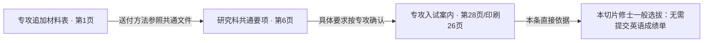

# 面向使用者的报告与来源关系展示

2026-09-29 用户最新顺序：暂停 QA-01 #233 / Draft #236，优先可读报告，再做东大多文件来源关系展示。M17 内完成；不恢复普通学生覆盖、MinerU 或 M13。设计基底 main `18e5528b2e7107a07797d85e09803211e62864e3`。

## 使用者拿报告做什么

拿到报告的人可能是申请者、老师或其他协助者。他要保存/转发一次查到的关键信息、安排准备顺序，并知道还需要补材料还是补充个人信息。报告不承担系统审核日志的角色。

报告的阅读顺序固定为：**申请目标与关注内容 → 优先待办 → 关键时间 → 材料准备清单 → 其他选中信息 → 简短范围说明**。无个人信息时仅整理要求，明确“未填写准备情况，暂不能判断还缺哪些材料”。不要求选择老师/学生身份，不新增账号。

默认从当前主页面已加载的结构化结果生成；用户可选当前已有的主题（如时间、材料、英语要求）。这只是选择报告内容，不是新增自由文本检索或AI报告生成。后续接入关键词结果需单独设计，不把未审核问答当招生结论。

| 报告要回答的问题 | 内容 | 不应出现 |
| --- | --- | --- |
| 我在查什么 | 学校、研究科/系、项目、年度/入学月、路线，所选主题 | 内部ID、hash、技术scope |
| 我现在先做什么 | 已确认尚未准备的材料、待填写条件、需人工确认分别列出 | 把unknown都称作缺材料；把未覆盖称为不需要 |
| 什么时候做 | 登记开始、送达截止、建议提前到达分别标明 | precision、end_time等内部字段；自行补截止时刻 |
| 具体准备什么 | 材料名、简短要求、个人自报准备状态、下一步 | 大段日文引文、逐项证据链、重复限制段落 |
| 信息有哪些边界 | 一条简短覆盖说明；必要的逐项条件留在该条 | 隐去条件后制造确定结论；整份材料齐全/保证资格 |

## 准备状态必须有真实含义

- “待补材料”：只用于当前规则明确适用且本人明确填报 `not_yet` 的材料。
- “已自报准备”：适用且明确 `available`；不等于审核合格/已被学校接收。
- “待填写准备情况”：`unknown` 或没填；不能计入缺失材料数量。
- “待确认是否适用”：条件不足/需审核；说明需要补充什么信息。
- “本项无需提交/不适用”：已审核结论支持；不计缺失，必要时单独简列。
- “当前资料未覆盖”：保留未知；不加入“已齐全”的判断。
- `action_group=action_required` 本身不等于缺材料；个人“我已处理”勾选也不改写官方要求或自报材料状态。

东科大已有材料准备输入与个人对照，可直接复用。东大当前只有三个材料主题与在职条件，不能生成完整材料缺失总数；若一项已判为需要提交但没有准备状态，写“需要准备，完成情况未填写”。本轮不新造东大个人材料追踪系统。

## 来源关系的可视化

报告预览/复制里不插证据链。用户进一步确认：**关系图也应在小窗口中，不完整塞进主页面。** 在已有两校四步流程的英语成绩单等材料卡中仅保留短结论和“查看依据关系（N份文件）”按钮；点击后打开关系图模态窗口，不新增页面/路由/导航，也不在卡片下展开占位大图。

图中每张文件卡显示文件简称、相关页、作用及“查看原文”。点击后在同一窗口内切换原文详情，提供“返回依据关系”；关闭按钮或Escape退出整个窗口，恢复主页面原卡片按钮焦点与滚动位置。返回图则恢复对应文件节点焦点与图内位置。桌面居中窗口，手机自适应内部滚动，始终至多一个模态框。实现复用既有原文查看器，不另建第二套来源组件。

现有 `material-slice-report-plan-v1.json` 已有审核过的关系，不需要用大模型猜：

这张图说明**引用与适用关系**，不是三份文件的优先级排行，也不表示三份都要求提交。结论旁保留“无需提交成绩单≠免除英语相关考查”。研究科共通和补充注记不新增普遍提交义务。

已有关系：E03→E01 cross_reference；E01→E02 department_specific_detail；E04→E05 consulting_is_distinct_from_submitting；E08→E06 corroborates_condition_with_submission_method；E07→E06是同在职背景但另属入学手续阶段，必须画成虚线“入学手续相关，非本次出愿提交义务”。关系名只在内部保留，用户看到中文解释。

仅按已审核关系画边；缺少关系就显示独立来源卡，不编线。记录级引用与同PDF不同页保持可追溯，不因按文件分组吞掉多个条款或阶段。原文弹窗保留准确标题、物理/印刷页、日文原文与官方PDF入口，不声称实现PDF坐标高亮。

## 复用与确实缺少的内容

| 已有成果 | 本次复用方式 | 差异 |
| --- | --- | --- |
| `service/static/unified-core.mjs` 的 legacyReport/sliceReport | 延续校验、target/snapshot绑定与现有数据输入 | 单独形成简洁的用户报告投影；不再把引文/内部字段复制给用户 |
| `service/static/app.js` 的 renderReferenceReport/copyReferenceReport | 原四步主页面、可选生成按钮、报告模态窗口 | 改报告信息顺序与内容选择，不重画整页 |
| `demo_requirements.py` 的材料与准备状态 | 使用现有 official_status/preparation_status/next_action | 区分缺材料、缺信息、待审核，不创造资格判定 |
| 既有 GSFS canonical JSON/Markdown、校验器 | 原样保留审核/校验用途 | 用户看到简洁投影；不改canonical内容、规则、hash |
| `app.js::openDemoEvidence` 与 evidenceDrawer | 继续使用原文、页码、链接和焦点返回 | 关系图节点进入同一查看器，不建立第二个PDF解析器 |
| `material_slice_report.py` 的已验证 relations | 图的唯一边来源 | 当前公开 ReferenceEvidenceResponse 未输出relations，后续任务只增兼容的展示字段 |
| `test_ui02_browser.py`、既有reference与材料报告测试 | 扩展同场景预览/复制/错目标/手机检查 | 检查用户能读懂，不能只断言节点存在 |

## 执行顺序与验证边界

拆成两个任务：**REPORT-02 可读报告 → EVID-UI-01 来源关系与弹窗**。只有REPORT-02可先Ready；第二项等第一项验收后再放行，避免同时修改共享app.js。QA-01暂停，不依赖其Draft合并，不把它的未验收改动混入报告分支。

REPORT-02无需修改生产Schema、规则、provider、检索或索引；不增加付费调用。EVID-UI-01只把已有审核关系安全地投影给前端，不新增事实或换文档。自然语言层reference_only不变，报告后端可追溯性保留。

完整交互样稿见 [reader-workspace-preview/README.md](reader-workspace-preview/README.md)，旧 `reader-report-preview.html` 仅保留入口。样稿直接读取当前已有的 `advanced.html`、`app.css`、`app.js` 与 `unified-core.mjs`，通过设计专用脚本叠加报告和关系窗口；不复制重写产品页面、不修改生产实现。可在同一页面完成两校选择、四步操作、报告预览/复制、材料卡→关系图窗口→原文→返回/关闭。

样稿的数据来自 UI-02 已有历史响应；个人材料状态交互是明确标注的合成示例，东大条件结果是三个已保存案例的回放，不运行新规则。东科大示例限定工学院/系统制御系两个入学批次，东大限定现有 CBMS 三个材料主题。问答保留布局但不运行模型。它是完整前端展示，不构成真实服务验收，也不表示东大普通学生覆盖已经完成。生产验收仍须在真实服务的原主页面对照截图与复制文本。
