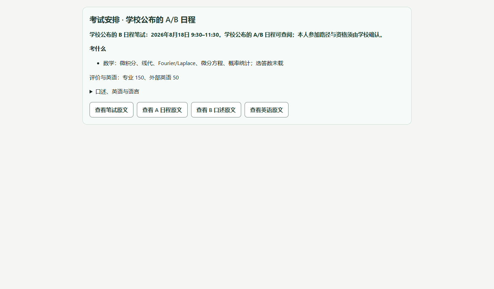

# 画面と検証記録

[READMEへ戻る](../../README.md)

UIは主に中国語を使用する留学支援担当者向けです。ここでは実装画面に日本語で説明を添えています。既存の検証画像を再利用し、内容の置き換えや架空の日本語UI化は行っていません。画面中の日付は固定した過去の募集要項のものです。

## 複数資料の根拠をまとめて確認

追加提出物一覧と専攻案内を一つのテーマに結び付けます。矢印はレビュー済みの補足関係です。二つの書類を両方提出するという意味ではありません。

**出所：** M19開発時の実HTTPブラウザ検証。[記録](../onboarding/m19-evidence/live-browser-journal.json)

## 何を準備するかを具体的に表示

フォームで志望情報を入力し、生成したPDFを保存して出願システムにアップロードする、という手順を示します。原文は必要に応じて開きます。画面上の「材料条件尚未核对」は、個人照合前の表示状態です。

**出所：** M19設計側の保存実レスポンス再生。新しい実HTTP試験ではありません。[独立記録](../onboarding/m19-design-evidence/five-topic-replay/replay-browser-journal.json)

## スマートフォンでレポートを確認

本人の準備状況を、公式の提出義務とは分けて整理します。レポートはコピー可能で、原文の長い一覧を本文に並べません。内部の出典検証は残ります。

**出所：** 上記と同じM19設計側再生。[コピーされた実テキスト](../onboarding/m19-design-evidence/five-topic-replay/desktop-copy-available-not_yet.txt)

## 東京科学大学：試験情報の構造化

日程・科目範囲・配点と原文入口を項目化しています。対象ルートが未確定の場合、学校が公開した日程の閲覧と、本人が参加できるという判断を区別します。

**出所：** EXAM-02の既存実資料に基づく投影・ブラウザ再生。[受入記録](../onboarding/exam02-design-acceptance.md)

## 画像を証拠として扱う際の境界

- いずれも既存の実装画像です。ユーザー数、商用運用、回答の一般的正確性を証明するものではありません。
- UI用のテスト入力であり、実在の学生の出願状況を掲載しているものではありません。
- 画像だけでは現在起動中のサービス版は特定できません。各記録のコミットと検証区分を参照してください。
- 全ページ表示、追加の原文画面、以前の版との比較は各Milestoneの証拠ディレクトリに保持しています。

